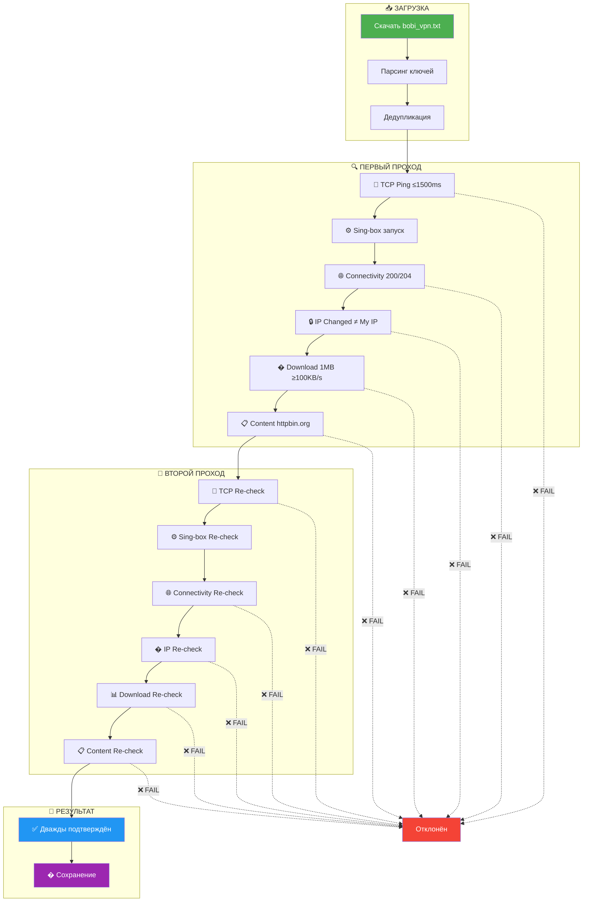

<p align="center">
  
</p>

<p align="center">
  
  
  
</p>

<h1 align="center">🔍 VPN Re-Checker PRO</h1>
<h3 align="center">Strict Edition — Zero Tolerance for Dead Keys</h3>

<p align="center">
  <i>Военная точность проверки VPN ключей</i><br>
  <b>6-этапная верификация • Двойной проход • Только 100% рабочие серверы</b>
</p>

<p align="center">
  
  
  
  
  
</p>

---

## 🧠 Философия

> *"Лучше 20 идеальных ключей, чем 200 наполовину рабочих."*

Основной чекер работает на объём — тысячи подписок, сотни ключей. Но часть из них **мертва на практике**: прозрачные прокси, captive portal, заблокированные в РФ.

**Re-Checker PRO** — это другой уровень. Он берёт уже проверенные ключи и пропускает их через **военную систему верификации**: 6 обязательных этапов, каждый ключ проверяется **дважды**. Выживают только сильнейшие.

---

## ⚔️ Основной чекер vs Re-Checker PRO

<table>
<tr>
<td width="50%" valign="top">

### 📦 Основной чекер
```
✦ Источник: Подписки (32K+ ключей)
✦ Параллелизм: 500
✦ TCP таймаут: 3 сек
✦ Download: favicon.ico (5KB)
✦ Смена IP: Опционально
✦ HTTP 403: ✅ Принимается
✦ Проверка контента: ❌ Нет
✦ Верификация: 1 проход
✦ Порты: С коллизиями
```

</td>
<td width="50%" valign="top">

### 🔍 Re-Checker PRO
```
✦ Источник: bobi_vpn.txt (проверенные)
✦ Параллелизм: 50 (надёжнее)
✦ TCP таймаут: 5 сек
✦ Download: 1MB файл (реальный)
✦ Смена IP: ⚠️ ОБЯЗАТЕЛЬНО
✦ HTTP 403: ❌ Отклоняется
✦ Проверка контента: ✅ httpbin.org
✦ Верификация: 2 ПРОХОДА
✦ Порты: Атомарные (уникальные)
```

</td>
</tr>
</table>

---

## 🏗️ Архитектура проверки



---

## 🎯 6 этапов верификации

<table>
<tr>
<td align="center" valign="top" width="16%">
<br>
<b>TCP Ping</b><br>
<sub>Подключение к серверу</sub><br>
<code>≤ 1500ms</code><br>
<code>timeout: 5s</code>
</td>
<td align="center" valign="top" width="16%">
<br>
<b>Sing-box</b><br>
<sub>SOCKS5 прокси</sub><br>
<code>startup: 3s</code><br>
<code>unique port</code>
</td>
<td align="center" valign="top" width="16%">
<br>
<b>Connectivity</b><br>
<sub>HTTP проверка</sub><br>
<code>200 / 204 ONLY</code><br>
<code>NO 403!</code>
</td>
<td align="center" valign="top" width="16%">
<br>
<b>IP Change</b><br>
<sub>Обязательная смена</sub><br>
<code>exit ≠ my IP</code><br>
<code>MANDATORY</code>
</td>
<td align="center" valign="top" width="16%">
<br>
<b>Download</b><br>
<sub>Реальный файл</sub><br>
<code>1MB file</code><br>
<code>≥ 100 KB/s</code>
</td>
<td align="center" valign="top" width="16%">
<br>
<b>Content</b><br>
<sub>Проверка контента</sub><br>
<code>httpbin.org</code><br>
<code>JSON parse</code>
</td>
</tr>
</table>

> [!CAUTION]
> Ключ считается рабочим **ТОЛЬКО** если прошёл **ВСЕ 6 этапов × 2 прохода = 12 проверок**.
> Один провал на любом этапе — мгновенное отклонение.

---

## 📁 Структура проекта

```
vpn_recheck_bin/
├── .github/
│   └── workflows/
│       └── vpn-recheck.yml      🔄 GitHub Actions (каждые 5 часов)
├── scripts/
│   └── vpn_recheck              🦀 Скомпилированный бинарник (Linux x86_64)
├── countries/                   🌍 Подписки по странам (auto-generated)
│   ├── russia.txt
│   ├── germany.txt
│   ├── finland.txt
│   └── ...
├── vpn.txt                      📄 Оригинальные рабочие ключи
├── vpn_renamed.txt              📄 С красивыми именами
├── bobi_vpn.txt                 🦊 Для Happ (с заголовком подписки)
├── bobi_vpn_lite.txt            🦊 Lite версия (RU/DE/FR/FI/Балтика)
├── vpn_report.json              📊 Детальный JSON отчёт
└── README.md                    📖 Документация
```

---

## 📊 Выходные файлы

### Основные подписки

| Файл | Формат | Описание |
|------|--------|----------|
| `vpn.txt` | Raw | Оригинальные рабочие ключи |
| `vpn_renamed.txt` | Raw | С именами `🇷🇺 Russia \| Yandex 1` |
| `vpn_base64.txt` | Base64 | Для импорта как подписка |
| `bobi_vpn.txt` | Happ | С заголовком профиля подписки |
| `bobi_vpn_lite.txt` | Happ | Lite: RU/DE/FR/FI/EE/LV/LT |

### По странам (`countries/`)

Каждый файл — полноценная подписка с заголовком:

```
#profile-update-interval: 1
#profile-title: 🇷🇺 BobiVPN Russia
#subscription-userinfo: upload=0; download=0; total=107374182400
#support-url: https://bobivpn.netlify.app/
#announce: base64:...

vless://...#🇷🇺 Russia | Yandex Cloud 1
vless://...#🇷🇺 Russia | Hetzner 2
```

### JSON отчёт (`vpn_report.json`)

```json
{
  "name": "🦊 Bobi VPN (Re-checked)",
  "total_checked": 200,
  "working_count": 45,
  "timestamp": "2026-03-02 15:30:00",
  "countries": {
    "RU": { "name": "Russia", "flag": "🇷🇺", "count": 12 },
    "DE": { "name": "Germany", "flag": "🇩🇪", "count": 8 }
  },
  "keys": [...]
}
```

---

## 🌍 География серверов

<p align="center">

**Приоритет 1 — СНГ:**
🇷🇺 Россия • 🇰🇿 Казахстан • 🇧🇾 Беларусь • 🇺🇦 Украина • 🇦🇲 Армения • 🇬🇪 Грузия • 🇲🇩 Молдова

**Приоритет 2 — Европа (основные):**
🇩🇪 Германия • 🇳🇱 Нидерланды • 🇫🇮 Финляндия • 🇸🇪 Швеция • 🇳🇴 Норвегия • 🇵🇱 Польша • 🇫🇷 Франция • 🇬🇧 Великобритания

**Приоритет 3 — Прибалтика:**
🇱🇹 Литва • 🇱🇻 Латвия • 🇪🇪 Эстония

**Приоритет 4 — Европа (остальные):**
🇦🇹 Австрия • 🇨🇭 Швейцария • 🇧🇪 Бельгия • 🇨🇿 Чехия • 🇮🇹 Италия • 🇪🇸 Испания • 🇬🇷 Греция • 🇮🇸 Исландия

**Приоритет 5-8 — Мир:**
🇹🇷 Турция • 🇮🇱 Израиль • 🇯🇵 Япония • 🇰🇷 Корея • 🇭🇰 Гонконг • 🇸🇬 Сингапур • 🇺🇸 США • 🇨🇦 Канада • 🇦🇺 Австралия

</p>

---

## 🔨 Сборка бинарника

### Требования
- **OS:** Linux x86_64
- **Rust:** 1.70+
- **sing-box:** в PATH (для GitHub Actions уже в workflow)

### Пошаговая сборка

```bash
# 1. Установка Rust
curl --proto '=https' --tlsv1.2 -sSf https://sh.rustup.rs | sh
source $HOME/.cargo/env

# 2. Проверка
rustc --version && cargo --version

# 3. Сборка (из папки vpn_recheck/)
cd vpn_recheck
cargo build --release

# 4. Копирование бинарника
cp target/release/vpn_recheck ../vpn_recheck_bin/scripts/

# 5. Коммит и пуш
cd ../vpn_recheck_bin
git add scripts/vpn_recheck
git commit -m "🦀 Add compiled binary"
git push
```

> [!TIP]
> Бинарник компилируется с `lto = true` и `strip = true` — максимальная оптимизация и минимальный размер.

---

## ⚙️ Конфигурация

Параметры жёстко вшиты в бинарник (изменять при пересборке):

```rust
// Производительность
MAX_CONCURRENT  = 50        // Параллельных проверок
TIMEOUT_TCP     = 5 сек     // TCP таймаут
TIMEOUT_PROXY   = 20 сек    // Проверка через прокси
STARTUP_DELAY   = 3 сек     // Ожидание запуска sing-box

// Строгие пороги качества
MAX_LATENCY_MS  = 1500 мс   // Максимальный пинг
MIN_SPEED_KBPS  = 100 KB/s  // Минимальная скорость
MIN_DOWNLOAD    = 500 KB    // Минимальный объём скачивания
```

---

## 🔄 GitHub Actions

Workflow запускается **автоматически каждые 5 часов** или **вручную**.

```yaml
schedule:
  - cron: '0 */5 * * *'   # Каждые 5 часов
workflow_dispatch:          # + ручной запуск
```

**Что происходит:**
1. 📥 Checkout репозитория
2. ⬇️ Установка sing-box v1.8.0
3. 🦀 Запуск бинарника `vpn_recheck`
4. 📤 Коммит результатов обратно в репозиторий

> [!NOTE]
> Timeout: **120 минут**. На ~200 ключей с двойной проверкой обычно уходит 20-60 минут.

---

## 📈 Ожидаемые результаты

```
Источник:        ~200 ключей из bobi_vpn.txt
Первый проход:   ~80-120 проходят (60%)
Второй проход:   ~50-90 подтверждены (70-80% от первого)
Итого:           ~50-90 идеально рабочих ключей

Отсев:           50-75% от исходных
Качество:        Максимальное
```

---

## ⚠️ Дисклеймер

> [!WARNING]
> **ВНИМАНИЕ — ПРОЧИТАЙ ПЕРЕД ИСПОЛЬЗОВАНИЕМ**

1. **Образовательные цели.** Данный проект создан исключительно в образовательных и исследовательских целях для изучения сетевых протоколов, асинхронного программирования на Rust и автоматизации CI/CD.

2. **Законодательство.** Использование VPN может быть ограничено или запрещено законодательством вашей страны. Перед использованием убедитесь, что вы не нарушаете применимые законы и нормативные акты.

3. **Отсутствие гарантий.** Программное обеспечение предоставляется «КАК ЕСТЬ» (AS IS), без каких-либо гарантий, явных или подразумеваемых. Авторы не гарантируют работоспособность, безопасность или пригодность для какой-либо конкретной цели.

4. **Ответственность.** Авторы и контрибьюторы не несут никакой ответственности за любой ущерб, прямой или косвенный, возникший в результате использования данного ПО, включая, но не ограничиваясь: потерю данных, нарушение конфиденциальности, юридические последствия.

5. **Третьи стороны.** Проект использует публично доступные серверы и подписки. Авторы не имеют отношения к владельцам этих серверов и не контролируют их содержимое.

6. **Использование на свой риск.** Загружая, устанавливая или запуская данное ПО, вы принимаете на себя все риски, связанные с его использованием.

---

<p align="center">
  <b>⭐ Если проект полезен — поставь звезду!</b>
</p>

<p align="center">
  <a href="https://github.com/seknei3/psychic-fiestas">
    
  </a>
</p>

<p align="center">
  <sub>Made with 🦀 and ❤️ by BobiVPN Team</sub><br>
  <sub>© 2024-2026 BobiVPN. All rights reserved.</sub>
</p>
